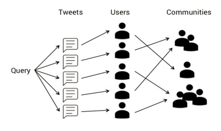
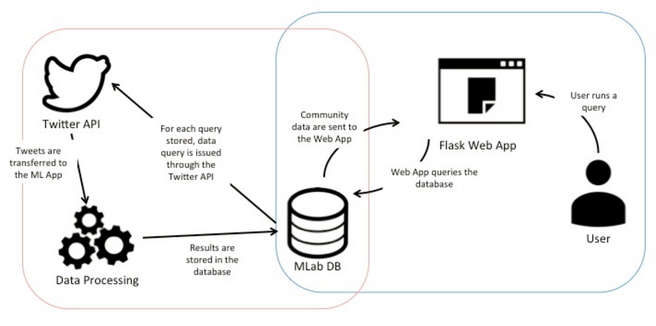
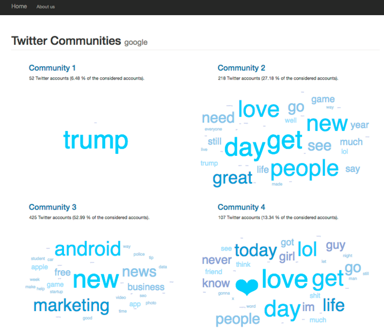
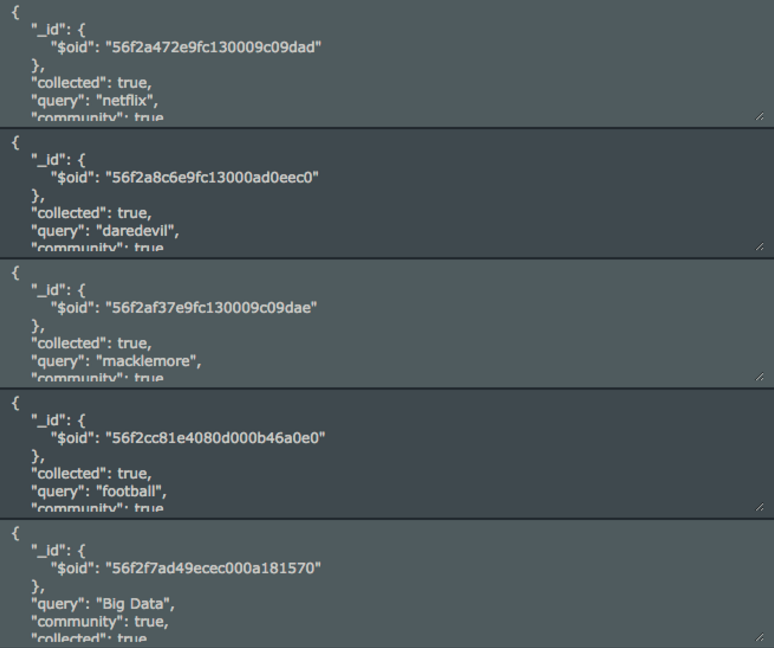
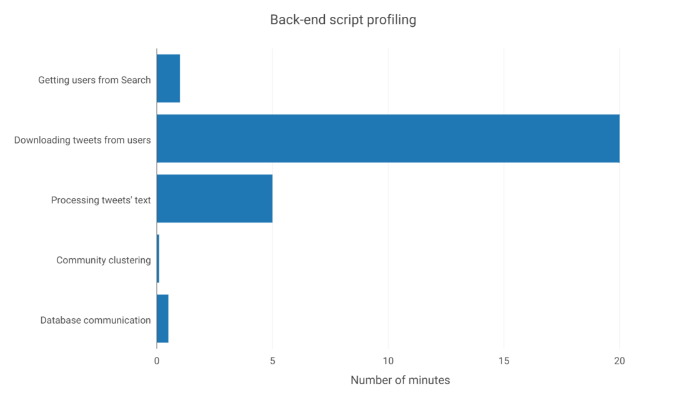
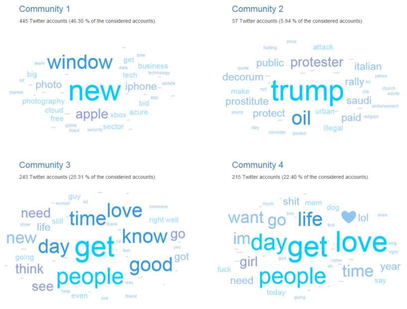
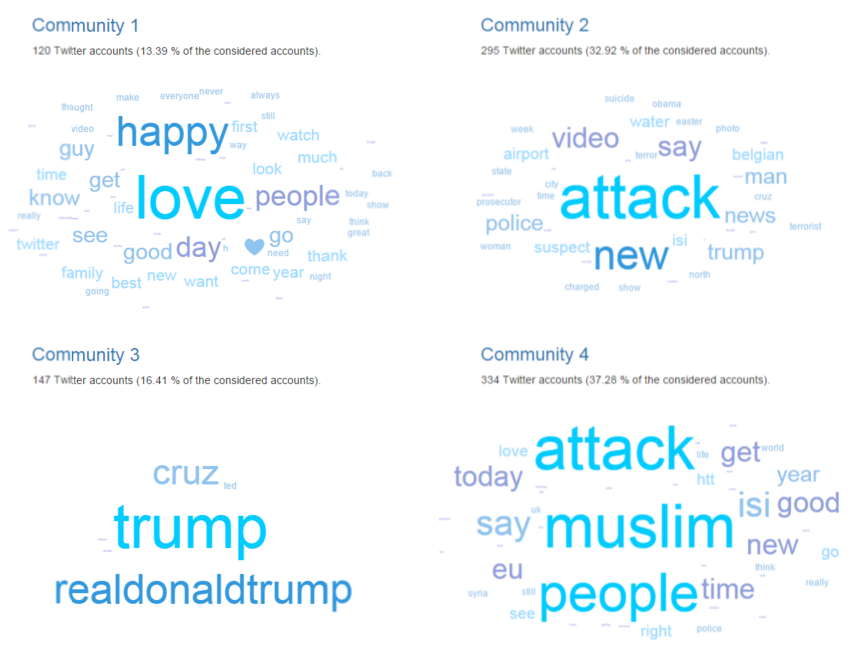
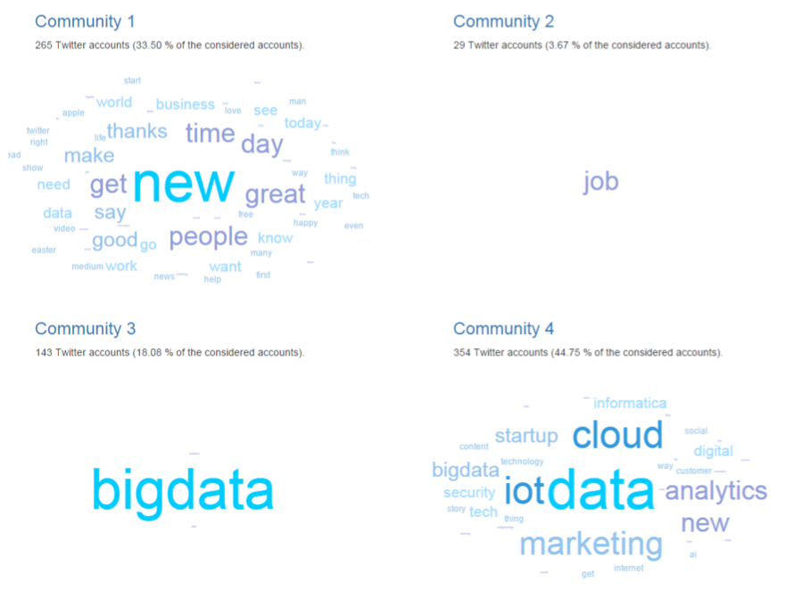

# CommuniTweet
**Discover user communities on Twitter**

[CommuniTweet.xyz](http://CommuniTweet.xyz)


*By Alexandre COMBESSIE and Thibaut DUGUET*


## 1. Introduction
### a. Project goals
Social networks are now playing an important part in the media industry. The data available on those media is very rich but still very little of this data is exploited. Yet, there is definitely great value in this data, but traditional companies struggle using this non structured source of information. For this project, we decided to look specifically at one of those social media, Twitter, which is by far the most open one, in order to build a product that could create some value from the available data. Social listening applications are already quite numerous, but they usually only enable their users to get an overview of some macroscopic analytics (number of followers, number of retweets for instance). The applications using the actual data created by the users are still quite rare.

More specifically, we tried to create clusters of users on Twitter based on text mining algorithms. There can be many applications of such a clustering, whether it is in marketing, or in the tourism industry for example. A first idea we had was to look at all the tweets containing a given query, a query being defined as a word or a set of words. This type of analysis is usually quite close to sentiment analysis but we decided to go one step further, and to analyse an audience and not only a corpus of tweets. We defined an audience based on the use of a given query in one tweet, but then we were also considering the tweets that the people composing this audience have created even when they were not speaking about the query.



*Figure 1: CommuniTweet principle*

### b. Architecture overview



*Figure 2: CommuniTweet Architecture*

We developed some classic architecture for a web application with some intelligence. We used the `flask` framework for the web app, mLab for the  database, and we deployed our application on Heroku. We also used as much as possible the Python packages that have already been developed, like `pymongo` or `tweepy` for instance, in order to be able to create a first version of our app within the short timeframe we had.

The two parts of our application are very independent for now. That’s a choice we made to ensure some robustness in the data processing. Thus, each user query is recorded and stored in the database, and those queries are processed with a one-per-hour rate by the back-end, which stores the results for each query, that we can then display when needed. When we started the project, we wanted to be able to display the results for any query in real time, but we had to be a little less ambitious for this first version. However, that’s a subject we’ve been thinking a lot about and we’ll present some of the solutions we could consider later in this report, after introducing the different components of our application.



## 2. Web app
### a. Presentation
For this project, we really wanted to make something that people could use, and that’s why we created a web app. Creating web application is a full time job, and we tried to use most of the common shortcuts that we could think of to get very quickly a first  “up and running” version of CommuniTweet.

In addition of just building the app, there were a lot of questions about design, UX, or UI, and what we’ve ended up with could be improved in many ways, as we didn’t have a lot of time to spend on those topics. Nevertheless, we’re quite happy with our first version, and there is indeed a lot of tools available to speed up the development process.   

### b. User interface
We’ve got two main pages for our application:
- The home page where users can run queries
- The result page that gets displayed when the communities for a given query has already been processed by our back-end.

We used Bootstrap templates to get very quickly a first skeleton of the two pages, and we added components when required.

Here is what it looks like:


*Figure 3: CommuniTweet home page*


On the result page, we wanted to give an idea of the size of each community, but also an idea of what each community was talking about. So to display the results we also used the JQuery plugin `jQCloud`, to display word clouds, based on the words that were creating the community (we’ll talk later on the building of the communities and what those words that we display actually mean).



*Figure 4: CommuniTweet result page*

Web design development is very different from what we are used to do. It’s a lot more about details. Using templates and frameworks is definitely a huge booster, but it’s also very confusing to start with a lot of code that you haven’t written and that you don’t know. There was a lot of code reading and code understanding before trying to make our own developments.


### c. NoSQL database
We chose to use mLab, which is “MongoDB-as-a-service”. We made this choice because MongoDB allows us to be very flexible in the documents we wanted to store in the database. In our first plans, we were storing a lot of data, but we then had to optimise a lot because of the 500 MB free account limit that was offered by the service. In the end, we only defined two collections:
One to store the user queries that we called “twitter_query”
A second one to store the communities, with the words and the weights for each word in each community. We called this second collection “twitter_community”.

Using the `pymongo` package, mLab has been really easy to use, and the flexibility it brought us was very interesting. Indeed, we are working with Twitter data and Twitter API, and what the API gives us is JSON data, and it was then really easier to store data like JSON objects, which we could do in mLab. The web interface is also very useful, as we can very easily browse our collections when developing our application:



*Figure 5: mLab exploration tool*

We actually had to face an issue with the database: we first wanted to use Google App Engine to deploy our application, but it is not possible to use the package PyMongo with Google App Engine, and we had already started to work with mLab when we realised that we couldn’t use both Google App Engine and `pymongo`. So we benchmarked the different possibilities we had, one of them was to use only Google services and to use Google DataStore instead of mLab, but we found it easier to remain with mLab and to use Heroku to deploy our application.


### d. Data Model
#### `Twitter_query` collection

Here is an example of an object from the `twitter_query` collection:
```
{
    "_id": {
        "$oid": "56f2a8c6e9fc13000ad0eec0"
    },
    "collected": true,
    "query": "daredevil",
    "community": true
}
```

The `_id` field is added automatically by mLab but we didn’t use it. However, we added two booleans to the query field, so that the back-end could know the status of each query and whether or not a given query has been processed. The `collected` field corresponds to the connection to the Twitter API and the collection of the raw data from Twitter, and the `community` field corresponds to the machine learning layer and it is changed to “True” when the results for the query has been stored in the `twitter_community` collection.

#### `Twitter_community` collection

It’s more complicated to display an object from the twitter_community collection. Each document contains the fields `_id`, `query` and `communities`. The `communities` field is a dictionary with one key `screen_names` which is a list of all twitter users that are classified in this community, and one key `words`, which is a list of dictionaries: for each word, we get the actual word and its weight to indicate how it should be displayed.

Here is a simplified   schema of this data model:
```
{“_id”:{“$oid”: ”56dhfgjkh6758jhbdfhjghj”},
 “Screen_names”: [“user1”, “user2”, “user3”...],
 “Words”: [{“word”: “word1”, “weight”: 0.23579}, {“word”: “word2”, “weight”: 0.084562}...]}  
 ```

The structure of the `twitter_community` collection is a bit complicated but, it’s actually very powerful and we didn’t really get any issue when using mLab service.

### e. Possible improvements
There remains a lot of things to develop for the web app. What we’ve been able to do until now is only some basic product with key functionalities: getting user queries and displaying results when possible. We could think of a lot more features depending on what people would like to see and do with our app. But without even talking about the quality of the results, we can definitely improve how results are displayed. We’ve decided to display only the words that are relevant for a given community based on this Python function:
```
def communityWords(text, i):
   raw_result = getCommunityInfo(text)
   community_i = raw_result['communities'][i]
   max_weight = community_i['words'][0]['weight']
   factor = 3
   results = []
   for i in range(len(community_i['words'])):
       if community_i['words'][i]['weight'] > max_weight/factor:
           results.append(community_i['words'][i])
   return results
```

But there is a balance to find between what we want to display and how complex it can be.

From a pure UX perspective, one feature we would like to implement very quickly would be some user account creation so that people would log in to our application, and we would then be able to display results that they have searched for in the past, or recommend results based on their past queries. At the UI level, we would want our app to be fully responsive. It can already be displayed nicely on several screen sizes but the experience is a little poorer on mobile phones.


## 3. Back-end data processing
### a. Data collection and storage
To collect our data, we leverage the Twitter REST API (dev.twitter.com/rest/public). In particular, we use the standard Python library `tweepy` in order to facilitate communication with the REST API. It provides a set of functions for the API methods such as  `GET search/tweets`  and `GET statuses/user_timeline` (the ones we used for this project). We also experimented with the Twitter Stream API, but it proved inconclusive for our use case.

In order to facilitate even more the data collection process, we created a Python module `twscrap` with our own class `TwitterApiUtil`. In this class, we defined attributes such as `tweepy.API` connection objects and remaining rate limits for `GET` methods. We also defined all the methods we use in our scripts or our other modules. This system of class proved particularly useful to setup an API rotation system in order to overcome Twitter’s rate limits. Note that we had to store our tokens as environment variables and it from Python using `os.environ.get`. This classic mistake could have resulted in hacking our tokens on GitHub.

As a matter of fact, overcoming the Twitter API’s rate limits was the main challenge of this part of our project. Assuming only one set of API tokens, we would be limited to one `GET search/tweets` of 1000 tweets and one `GET statuses/user_timeline` for 300 users every 15 minutes. The full list of limits is available on dev.twitter.com/rest/public/rate-limits.


For our use case, these limits were unacceptable. Therefore, we gathered a total of 6 tokens, and developed an intelligent method for API rotation for both `search/tweets` and `statuses/user_timeline`. You can see an example below. The key idea is to avoid querying the `GET rate_limit_status` method too much, as it also have rate limits. We also minimize the waiting time for the rate limit of all tokens to replenish.
```
def get_api_usertimeline(self):
   self.rate_limit_counter -= 1
   while self.rate_limit_counter < 1:
       self.rate_limit_status = [x.rate_limit_status() for x in self.apis]
       self.rate_limit_app = [x["resources"]["statuses"]["/statuses/user_timeline"]
for x in self.rate_limit_status]
       self.rate_limit_counter = [x["remaining"]
for x in self.rate_limit_app][self.current_api_index]
       apis_reset = [x["reset"] - time.time() for x in self.rate_limit_app]
       if max([x["remaining"] for x in self.rate_limit_app]) < 1:
           time.sleep(min(apis_reset))
           print("sleeping for " + str(min(apis_reset) + " seconds"))
           self.current_api_index = apis_reset.index(min(apis_reset))
       else:
           self.current_api_index = [x["remaining"] for x in self.rate_limit_app].index(
               max([x["remaining"] for x in self.rate_limit_app]))
   return (self.apis[self.current_api_index])
```

Within the class `TwitterApiUtil`, we defined two methods for our data collection pipeline:
1. A function `tw_users_from_search` to extract a list of unique user screen names from a given search query (with a parameter controlling the number of query results)
2. A function `get_tweets_from_user` to collect the text from the most recent tweets of a given list of users (with a parameter controlling the number of tweets per user)

The combination of these two methods into get_tweets_from_search then allows us to extract the data that we want in a single function.

For storing our data, we created a small `mongolab` utility module based on the library `pymongo` to easily communicate with our NoSQL database in the cloud (hosted at mlab.com). Similarly as before, we put our private connection URI as environment variable to avoid hacking.

### b. Data preparation
Our data is exclusively text-based, so we implemented all the standard steps of text pre-processing within another module called `textproc`. We used the combination of two Python libraries for text mining (`nltk` and `pattern`) to build a general tweet_to_words function encompassing:
- UTF-8 encoding
- Word tokenization in the case of tweets (handling @mentions, #hashtags and URL)
- Stopword, punctuation and URL removal
- Part-of-Speech tagging and filtering
- Stemming
- Lemmatization

This function worked fully for both French and English, but we chose to use English by default in our web app. By default we implemented steps except stemming, as we found it reduced the interpretability of our results. You can see an extract below:
```
def tweet_to_words(tweet, query_filter, lang="en", stopwords=True,
                  POStagfilter=True, stemming=False, lemmatization=True):
   if lang == "en":
       words = EnglishTweetTokenizer.tokenize(
removeURL(tweet.encode("utf-8",errors="ignore").decode("utf-8",errors="ignore").lower().replace(query_filter.decode("utf-8", errors="ignore").lower(), "")))
       words = [x for x in words if x not in excludepunctuation]
       if stopwords:
           words = [x for x in words if x not in EnglishStopwords]
       if POStagfilter:
           tags = [EnglishTag(word)[-1] for word in words]
           words = [x[0] for x in tags if x[1] in TagSelection]
       if stemming: words = [EnglishStemmer.stem(x) for x in words]
       if lemmatization: words = [EnglishLemmatizer.lemmatize(x) for x in words]
   return(words)
```

We used it  to define a last `TwitterApiUtil` method, `get_tweets_from_search_cleaned`, which takes as input a given query and returns a list of processed “Bag of Words” for each user that appears in the query result. We give this method access to all the parameters of the other functions it uses, so that we can tune it as we wish.

### c. Machine Learning
As expected, all the Machine Learning done in this project is based on the amazing Python library  `sklearn`. First, we use the built-in function `TfidfVectorizer` to turn the list of “Bag of Words” from the previous part into a sparse matrix of Term Frequency - Inverse Document Frequency (TF-IDF). Note that we had to bypass `sklearn` built-in tokenizer to directly use our own bag of word. We filter the most frequent and less frequent terms by specifying % thresholds. This sparse matrix is built with the underlying Python library `scipy` with C and Fortran dependencies. This ensures a low memory utilization and fast computation.

Second, we reduce the dimension of this matrix by applying a Latent Semantic Analysis (LSA) algorithm designed for text mining: the truncated Singular Value Decomposition (SVD). This algorithm is similar to the classic Principal Component Analysis (PCA). By normalizing and keeping only the first 500 components of this decomposition, we are able to explain more than 50% of the variance of the sample (varying from one query to another).

Finally, we apply the classic clustering K-means algorithm to our smaller reduced matrix to find communities of users. To standardize our results, we set a fixed number of 4 communities.  Once the algorithm has converged (with several random initializations) and found the communities, we do an inverse SVD transformation to go back to the original TF-IDF space. We can then study the centroids of each cluster. This allows us to derive the top terms of each cluster in terms of TF-IDF score.

All of this process is embedded into a single function `cluster_tweets` within the module `docluster`. It takes as input the results of `get_tweets_from_search_cleaned` and returns an object with the query, the communities’ users, and the top N terms of each community. This object is under the form of a cascading Python dictionary that we can easily convert into a json and insert it into our document-oriented database.
```
{"query": "my query",
"communities":
[
{"screen_names": ["Alexandre", "Thibaut", ...],
	"words": [{"text": "hello", "weight": 0.42},{"text": "world", "weight": 0.07}, ...]},
{"screen_names": ["Bill", "Steve", ...],
	"words": [{"text": "window", "weight": 0.1},{"text": "apple", "weight": 0.2}, ...]},
{"screen_names": ["Leonard", "Penny", ...],
	"words": [{"text": "physics", "weight": 0.3}, {"text": "actor", "weight": 0.4}, ...]},
{"screen_names": ["Matt", "Stick", ...],
	"words": [{"text": "devil", "weight": 0.5}, {"text": "kungfu", "weight": 0.6}, ...]}
]
}
```


### d. Processing pipeline
Thanks to our four Python modules `twscrap`, `mongolab`, `textproc`, `docluster`, we were able to write a simple script to perform the entire pipeline on its own on any new query that is inserted in our database. You can find a shortened version of it below:
```
from twitterapp.twscrap import TwitterApiUtil
tw_util = TwitterApiUtil()
import twitterapp.mongolab as mlab
import twitterapp.docluster as clust

current_query_status = mlab.download_query()
index_to_be_processed = [t["collected"] for t in current_query_status].index(False)
query_to_be_processed = [t["query"] for t in current_query_status][index_to_be_processed]

raw_data = tw_util.get_tweets_from_search_cleaned(query_to_be_processed,
n_items_search=1200, n_tweets_per_user=200)
mlab.update_status_collected(query_to_be_processed)

cluster_data = clust.cluster_tweets(raw_data)
mlab.upload_twitter_community(cluster_data)
mlab.update_status_clustered(query_to_be_processed)
```

The first 3 lines after the try are for retrieving the last query that has not been processed from the database (updated by the front-end part of the app). Then, based on this query, we launch our data collection and preparation combined method. Based on the results, we can launch our clustering function and upload the results to our database. Note that at each step, we update the query collection in our database to check that raw data has been collected and clustered. In the real version of our script, we did a few additions: a `try/except` to handle cases where there is no query to process, an `if/else` to avoid clustering a dataset with less than 10 users, and several monitoring functions to check that the script is running properly.

We then put our entire app on the hosting platform Heroku and setup a scheduler system to run this script hourly. Hence, we can process at most 24 new queries per day.

### e. Challenges encountered
Along the project course, we met multiple programming and technical challenges, that we managed to overcome for the most part. Here are the most important ones:

As described in section 3.a., avoiding the rate limits of the Twitter API was initially a big problem. We had to create additional API tokens and custom API rotation methods.
We had to rewrite several modules from Python 3.4 to Python 2.7 in order to be compatible with Google App Engine (our initial choice of hosting platform)
This switch caused many problems with unicode, which we partially solved through explicit string encoding/decoding . However, we had to remove some invalid unicode characters with a manual filter (probably because of weird emoticon formats)
The text mining library nltk proved too slow for Part-of-Speech tagging (due to an external Java dependency) and did not allow for French lemmatization. Therefore we had to integrate another library, pattern.
Because of C/Fortran dependencies, our chosen hosting platform Heroku does not support `Scipy` by design. We had to try several unofficial Python buildpacks made by other developers to make it work.

### f. Possible improvements
The key area of improvement of our back-end is time. Despite our efforts, we could not make our app real-time. With our chosen parameters of 1200 search results and 200 tweets per users, the total processing time of a given query is about 20-30 minutes. By cutting it to 1000 search results and 100 tweets per user, we can cut it to 10-15 minutes, but it is still nowhere close to real-time.

Since our script can only be run hourly according to the free offering of Heroku, we decided to go for quantity instead of speed. Our chosen parameters are close to the maximums allowed by the Twitter API. You can see below an approximate profiling of our script for these parameters:



*Figure 6: Profiling chart*

We see clearly that the biggest bottleneck of our script is the tweet downloading and text processing. It would be possible to accelerate it through parallelization. It would be rather simple to implement it. For tweet downloading, we can distribute the list of users over several machines (or maybe network ports) and launch parallel downloads. Some communication between machines/ports would still be required to check for common API rate limits. For text processing, the parallelization is immediate: each machine can handle a certain number of tweets. Provided we have a budget for renting several machines (called workers on Heroku), these improvements would be possible.

## 4. Selected results
### a. For a brand: Microsoft



The first community represents more than 46% of the audience we considered. It looks like a technophile group of people, and from a marketing standpoint, you might want to target those people and “look-a-like” people with some personalised and maybe more technical messaging.

We also usually get a community that is composed of people tweeting about general news: this community is quite small for this example but that’s usually a community which engages with a lot of subjects, and that has potentially a very large audience. It might interesting to contact those twitter users and get a direct relationship with them.

Finally, we also very often get communities with more “personal life” content. That’s probably people with much less technical expertise, and the right messaging should probably be different for these communities.

From this very light analysis, we can get an idea of some application of our product in marketing through customer segmentation and message targeting.


### b. For a news event: Brussels’ attack



In the news industry, social media can also prove very useful, as it allows journalists to get insights almost in real time. After Brussels attack, we looked at the communities created by our app, and how people reacted to this dramatic event. Some keywords can be surprising, and the importance of the American political life is also a phenomenon that can be analysed further.

### c. For a topic: Big Data



It is interesting to see that two small clusters (less than 20% of the total population considered) are only highlighted by one word. It means that almost all their tweets contain the words “job” or “BigData”. It is very probable that these users are not humans but twitter bots. We actually visited a few user profiles from these cluster, and it appears that they are either automated job posting or Big Data news retweeters. This type of filtered wordcloud is very useful to detect anomalies.

In contrast, there are two large clusters of human users with very different types of semantic topics. Community 1 encompasses “leisure” users tweeting about their everyday life (“happy”, “new”, “great”, “thanks”) whereas Community 4 users only tweet about data, technology and startups.

We note that whatever the query we use, we almost always find one community of “leisure users” using non-specific words of everyday life, and often a lot of heart emoticons. This is a sign that users can have very different types of uses of the Twitter platform.


## 5. Conclusion

This project was a great learning opportunity. First, we learnt how to really program in Python, outside the simplistic abstraction of Jupyter Notebooks. We understood how to structure a Python app. We leveraged Python’s object-oriented design to build our own classes with attributes and methods. We developed our own modules to simplify our scripts.

Second, we learnt to code as a team. We understood how to split the app into separate bricks to work on. We got to use Git a bit better. We understood the differences between the front-end and the back-end. We understood how each brick is tied to different Python packages, with their own classes and “philosophies”.

More importantly, we learnt to deploy our code. We did not develop just a local Proof of Concept. Our project is running live! It is publicly accessible on the Internet. Although we had some difficulties porting our local code to the Cloud, it was worth it. Our hope is to keep working on this project to improve it and make it more scalable.
